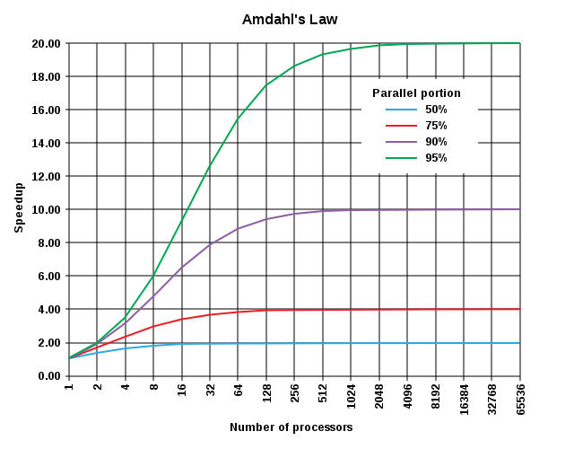

title: "Actor Model in Erlang"
date: 
tags:
- Erlang
- Actor Model
- Concurrency
- Distributed Computing
---

### Concurrency
_Definition:_ The ability of an executing program to run decomposed instructions in a parallelized fashion efficiently utilizing available resources.

From Joe Armstrong [10]:


The way to phrase it, in my mind, is parallelism differs in that it is a purely physical difference, i.e. running the same program at the same time across similar devices, whereas concurrency infers running on the same machine (i.e. use of threads). But for the sake of this discussion, they may be used interchangeably

### Traditional Concurrency
Programming languages typically offer concurrent operation through the use of threads.  Given the lack of atomicity in the use of threads, locking primitives such as semaphores or mutexes are required. This can create difficult to program and debug situations, such as deadlock. For brevity, this survey assumes some knowledge of current concurrency models.

### Thinking about Parallelization
Obviously, computing speeds have continued their march to the beat of Moore's Law, and given the complexity in writing concurrent programs that take advantage of the processors and architectures at the time, it's not always worth it to consider writing software in this way. But there's speculation that we may begin to see the perhaps potential physical limitations: there's only so many transistors you can continue to fit into ever smaller physical areas.  

So, the use of parallelization becomes more and more attractive.  Amdahl's Law basically gives a good rule of thumb for how parallelized a program can get [My definition]:
> A program is only parallelizable in terms of it's slowest part.



## Actor Model
Actors are a concurrency primitive that do not share resources with another actor. They share state/data via message passing.

An actor is an entity that has a mailbox and a behavior. It takes a message and can then send messages to other actors, create new actors, and return another actor describing its next behavior.

>Concurrency in actors is constrained only by the availability of hardware resources and by the logical-dependence inherent in the computation. - Gul Agha [1]

The actor model is a framework to think about, model, and build distributed concurrent systems.

### Quick History
The Actor Model was first proposed by Carl Hewitt in 1973 (yeah, the actor model is fully entrenched in middle age :))  It was further solidified over many years by a number of other computer scientists and by Gul Agha in his disseration on the Actor Model in 1985 [1].

### Important Concepts
1. No shared state between actors
2. Functions asynchronously
2. All about message passing for communication
  4. Only way to share/change state is through this message passing

### Enter Erlang...
The actor model is inherent to Erlang and is built into the language and somewhat fundamental to understanding the distributed nature of Erlang. 

One thing to note, is Erlang was designed for the telephony industry, so some of the driving ideals such as _reliability_ demanded that Erlang utilize a model that didn't incur potential for data loss, that is possible in the more traditional concurrency models discussed above.

>An Erlang program describes a series of functions. Each function uses pattern matching to determine which function to execute.[6]

In Erlang, each thread of execution is a lightweight process.[4] 

Erlang utilizes pattern matching to process messages.

>The Erlang view of the world is that everything is a process and that processes can interact only by exchanging messages. - Joe Armstrong [7]

#### Creating a process
To create a process in Erlang, just call `spawn`, which will return a process id (pid) (refer to the Erlang docs for the signature of `spawn` you want).  Here, the example uses `spawn/3` (`spawn(Module, Function, Args) -> pid()`) [5]
```
-module(actor_file).
...
start() -> 
  spawn(actor_file, run, []).
```

Calling `start/0` here returns the pid:
```
1> c(actor_file).
2> Pid = actor_file:start().
3> Pid.
<0.80.0>
```
But it's not a process in the OS definition. It's an Erlang process, so it runs in the Erlang VM. It runs in user space, not bound to the kernel, so is scheduled by the Erlang Scheduler. 

And it's a lightweight process...how lightweight: 
> A newly spawned Erlang process uses 309 words of memory [4] 

From the Erlang docs on memory:
>The unit of measurement is memory words. There exists both a 32-bit and a 64-bit implementation. A word is therefore 4 bytes or 8 bytes, respectively. [6]

In fact, let's check how much memory our process(es) are using:
```
{_,Bytes} = process_info(actor_file:start(), memory).
  {memory,2720}
```

And they are very quick to spawn...from Joe Armstrong:
> Spawning 20,000 processes took an average of 3.0 microseconds/process of CPU time and 3.4 microseconds of elapsed (wall-clock) time.

### How Erlang schedules a process
Erlang uses a preemptive scheduler. A preemptive scheduler works by running tasks, preempting, then resuming them based on a specific metric, such as priority, time or reduction.  Many other async languages, such as Node.js and Python's Twisted, utilize cooperative scheduling, which requires tasks to release themselves voluntarily.

Erlang's preemptive scheduler uses a reduction count. A reduction is typically a function call, garbage collection, message sending, etc. The reduction count for an Erlang process is 2000, which can go quite quickly.

Additionally, processes do and can be flagged with priorities: 'max', 'high', 'normal', and 'low'.

The scheduler makes Erlang a great choice for low-latency, parallelized programs as it can manage multi-tasking efficiently, given that it doesn't allow any one process to monopolize resources.

### References and Further Reading
[1] Agha, Gul, _Actors: A Model of Concurrent Computation in Distributed Systems_, http://www.cypherpunks.to/erights/history/actors/AITR-844.pdf, 1985.
[2] Vermeersch, Ruben, _Concurrency in Erlang & Scala: The Actor Model_ https://rocketeer.be/articles/concurrency-in-erlang-scala, 2009.
[3] Hebert, Fred, The Hitchhiker's Guide to Concurrency, _Learn You Some Erlang: for great good!_, http://learnyousomeerlang.com/the-hitchhikers-guide-to-concurrency, 2013.
[4] Erlang/OTP System Documentation, http://erlang.org/doc/index.html, 2016
[5] http://erlang.org/doc/reference_manual/processes.html
[6] http://erlang.org/doc/efficiency_guide/advanced.html
[7] Armstrong, Joe. _Programming Erlang: Software for a Concurrent World_, 2nd Ed, 2013.
[8] Tate, Bruce. _Crossing borders: Concurrent programming with Erlang_, http://www.ibm.com/developerworks/java/library/j-cb04186/j-cb04186-pdf.pdf, 2006.
[9] https://hamidreza-s.github.io/erlang/scheduling/real-time/preemptive/migration/2016/02/09/erlang-scheduler-details.html
[10] http://joearms.github.io/2013/04/05/concurrent-and-parallel-programming.html
[11] http://yosefk.com/blog/parallelism-and-concurrency-need-different-tools.html
[12]  Andersen, Jesper Louis> _How Erlang does scheduling_, http://jlouisramblings.blogspot.co.uk/2013/01/how-erlang-does-scheduling.html, 2013.
[13] https://www.youtube.com/watch?v=7erJ1DV_Tlo&feature=youtu.be

